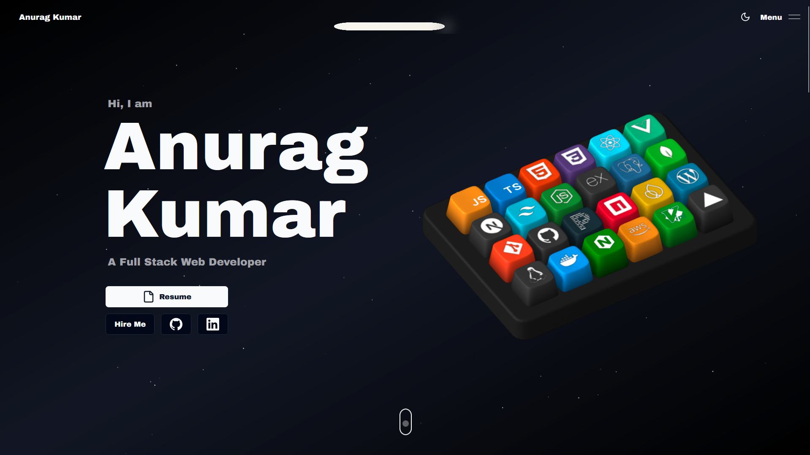
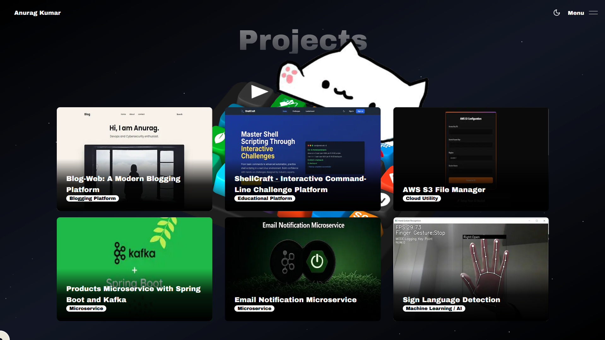
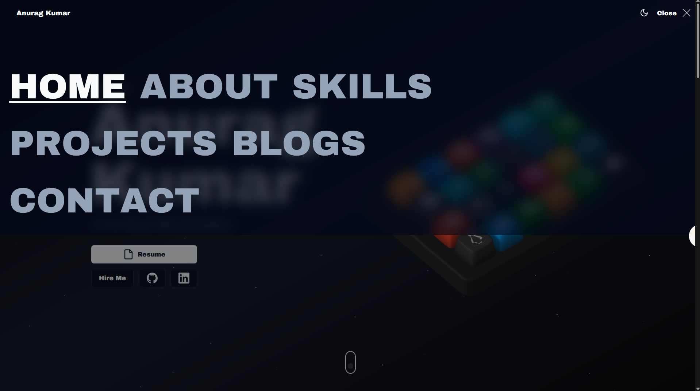
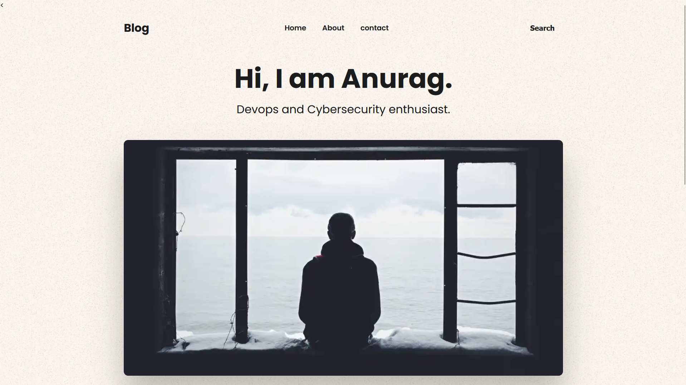
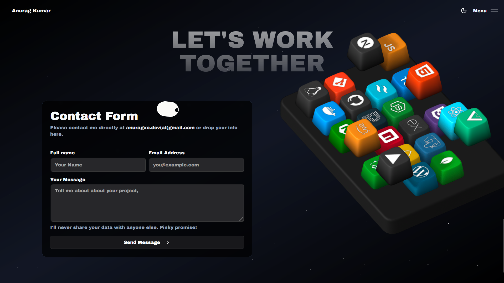
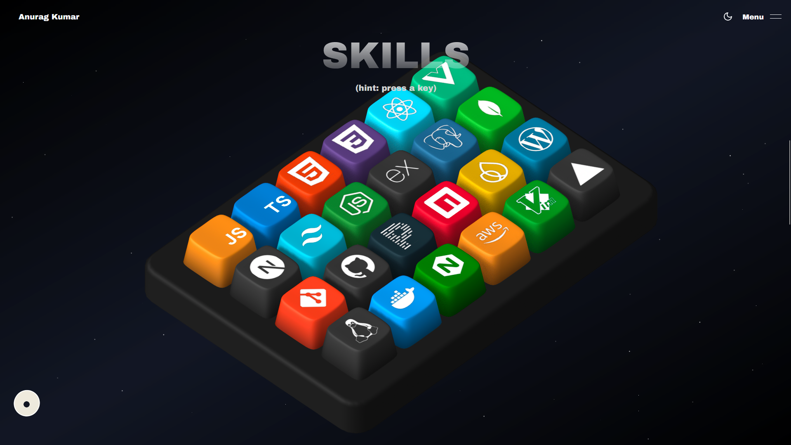

# Portfolio

<div align="center">
  
</div>

<p align="center">
  A stunning, interactive, and animated personal portfolio website built with Next.js, TypeScript, and Tailwind CSS.
</p>

<p align="center">
  <a href="https://anuragsite.duckdns.org" target="_blank">
    
  </a>
</p>

<p align="center">
  
  
  
  
  
  
</p>

## ✨ Features

- **Interactive & Animated UI**: Engaging user experience with animations powered by Framer Motion, GSAP, and Spline 3D scenes.
- **Real-time Collaboration**: See other visitors' cursors in real-time, powered by Socket.io.
- **Blog**: A dedicated section for blog posts.
- **Projects Showcase**: A detailed view of all my projects with screenshots and descriptions.
- **Contact Form**: A functional contact form that sends emails using Resend.
- **Responsive Design**: Fully responsive and mobile-friendly design.
- **Dark/Light Mode**: Seamless theme switching with a fun toggle.
- **Easter Eggs**: Discover hidden surprises like the Nyan Cat!
- **Custom UI Components**: Built with Aceternity UI, Radix UI, and Shadcn UI for a modern and accessible interface.
- **Smooth Scrolling**: Implemented with Lenis for a smoother scrolling experience.
- **Preloader**: A beautiful preloader animation.
- **Online Users**: See the number of users currently online.
- **Elastic Cursor**: A fun, elastic cursor effect.
- **Floating Dock**: A modern, floating dock navigation menu.
- **3D Pin Effect**: An interactive 3D pin effect on the skills section.
- **Animated Modal**: A sleek animated modal for displaying more information.
- **Reveal Animations**: Animations that trigger on scroll.
- **Containerized**: Fully containerized with Docker for consistent development and production environments.
- **CI/CD Pipeline**: Automated CI/CD pipeline with GitHub Actions for building, testing, and deploying the application.
- **Kubernetes Ready**: Helm chart for easy deployment to a Kubernetes cluster.
- **AWS Deployment**: Deployed to AWS EC2 with automated deployment scripts.

## 🛠️ Tech Stack

- **Framework**: [Next.js](https://nextjs.org/)
- **Language**: [TypeScript](https://www.typescriptlang.org/)
- **Styling**: [Tailwind CSS](https://tailwindcss.com/), [SASS](https://sass-lang.com/)
- **Animation**: [Framer Motion](https://www.framer.com/motion/), [GSAP](https://greensock.com/gsap/), [Three.js](https://threejs.org/), [Spline](https://spline.design/)
- **UI Components**: [Aceternity UI](https://ui.aceternity.com/), [Radix UI](https://www.radix-ui.com/), [Shadcn UI](https://ui.shadcn.com/)
- **Real-time**: [Socket.io](https://socket.io/)
- **Email**: [Resend](https://resend.com/)
- **Linting**: [ESLint](https://eslint.org/)
- **Containerization**: [Docker](https://www.docker.com/)
- **Orchestration**: [Kubernetes](https://kubernetes.io/), [Helm](https://helm.sh/)
- **CI/CD**: [GitHub Actions](https://github.com/features/actions)
- **Cloud**: [Amazon Web Services (AWS)](https://aws.amazon.com/)

## 🚀 Getting Started

To get a local copy up and running, follow these simple steps.

### Prerequisites

- Node.js (v20.x or higher)
- npm, yarn, or pnpm
- Docker (for containerized development)

### Installation

1.  Clone the repo
    ```sh
    git clone https://github.com/your_username/your_repository.git
    ```
2.  Install NPM packages
    ```sh
    npm install
    # or
    yarn install
    ```

### Running the Application

To run the app in the development mode, use:

```sh
npm run dev
# or
yarn dev
```

Open [http://localhost:3000](http://localhost:3000) to view it in the browser.

### Local Development with Docker

You can also run the application using Docker Compose for a consistent development environment.

1.  Build the Docker image:
    ```sh
    docker-compose build
    ```
2.  Start the application:
    ```sh
    docker-compose up
    ```

##  CI/CD

This project uses GitHub Actions for its CI/CD pipeline. The workflows are defined in the `.github/workflows` directory.

-   **`build-and-push.yaml`**: This workflow is triggered on every push to the `main` branch. It builds the Docker image and pushes it to Docker Hub.
-   **`ci.yaml`**: This workflow is triggered on pushes to the `production/deploy` branch. It performs the following steps:
    1.  Installs dependencies and runs linting and tests.
    2.  Builds the Next.js application.
    3.  Builds and pushes a Docker image to both AWS ECR and Docker Hub.
    4.  Deploys the application to an AWS EC2 instance using SSH.

## 🐳 Containerization & Orchestration

### Docker

The application is fully containerized using Docker. The `Dockerfile` defines a multi-stage build process to create a small, optimized production image. The `docker-compose.yml` file is provided for easy local development and testing.

### Kubernetes

A Helm chart is available in the `k8s/portfolio-app-chart` directory for deploying the application to a Kubernetes cluster. The chart is configurable through `values.yaml` and includes templates for:

-   **Deployment**: Manages the application pods.
-   **Service**: Exposes the application within the cluster.
-   **Ingress**: Manages external access to the application.

## ☁️ AWS Deployment

The application is deployed to an AWS EC2 instance. The deployment process is automated through the `ci.yaml` GitHub Actions workflow, which securely connects to the EC2 instance via SSH and runs a deployment script.

## 📸 Screenshots

Here are some screenshots of the portfolio:

|                                       Landing Page                                        |                                        Projects                                        |                                      About                                       |
| :---------------------------------------------------------------------------------------: | :------------------------------------------------------------------------------------: | :------------------------------------------------------------------------------: |
|  |  |  |

|                                      Blog                                      |                                       Contact                                        |                                       Skills                                       |
| :----------------------------------------------------------------------------: | :----------------------------------------------------------------------------------: | :--------------------------------------------------------------------------------: |
|  |  |  |

## 📄 License

Distributed under the MIT License. See `LICENSE` for more information.

